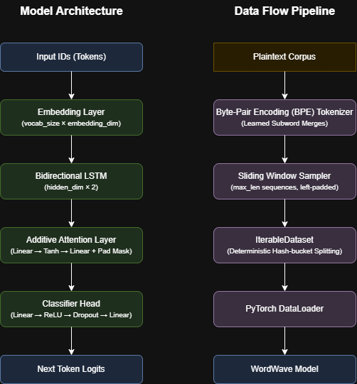

# WordWave

[](https://www.python.org/)
[](https://pytorch.org/)
[](https://streamlit.io/)
[](https://opensource.org/licenses/MIT)

**WordWave** is a word-level next-token predictor powered by a **Bidirectional LSTM with additive attention**, trained on any plaintext corpus via a streaming `IterableDataset`. It ships with a **Streamlit dashboard** for interactive text generation and metric-based evaluation.

---

## Table of Contents

- [Features](#features)
- [Architecture](#architecture)
- [Training Pipeline](#training-pipeline)
- [Decoding Strategies](#decoding-strategies)
- [Evaluation Metrics](#evaluation-metrics)
- [Getting Started](#getting-started)
- [Configuration](#configuration)
- [Project Structure](#project-structure)
- [Testing](#testing)
- [References](#references)
- [Future Work](#future-work)
- [Author](#author)

---

## Features

- **BiLSTM + Attention model** — captures bidirectional context and learns to focus on the most informative timesteps via an additive attention pooling layer.
- **Byte-Pair Encoding (BPE) Tokenization** — custom subword tokenizer built from scratch that eliminates out-of-vocabulary (OOV) tokens and optimizes vocabulary representation, matching modern LLM pipelines.
- **Dynamic Plaintext Detection** — uses a combined Git-style NULL byte heuristic and strict UTF-8 checking to automatically distinguish and load any valid text file (regardless of extension) while silently ignoring binaries. *(Note: legacy encodings like windows-1252 are intentionally ignored to ensure a clean UTF-8 corpus).*
- **Streaming data pipeline** — trains on corpora of arbitrary size using `IterableDataset` with deterministic hash-based train/validation/test splits at the line level, avoiding data leakage across splits.
- **Multiple decoding strategies** — beam search, nucleus (top-*p*) sampling, and temperature sampling, selectable at generation time.
- **Reproducible training** — configurable random seed applied across `random`, `numpy`, and `torch` for deterministic runs.
- **Training stability** — gradient norm clipping, learning rate scheduling with `ReduceLROnPlateau`, early stopping, and optional mixed-precision (FP16) training.
- **Checkpoint management** — periodic best and latest checkpoints saved to disk with full optimizer/scheduler state for seamless resumption.
- **Interactive Streamlit UI** — enter a seed phrase, configure generation parameters, and inspect top-5 accuracy, perplexity, and BLEU scores in real time.

---

## Architecture

The model follows an **Embedding → BiLSTM → Additive Attention → Classifier** pipeline:



1. **Embedding layer** maps each token to a dense vector. Padding tokens (`<pad>`, index 0) produce zero gradients.
2. **Bidirectional LSTM** ([Schuster & Paliwal, 1997](#references)) processes the sequence in both directions. The forward and backward hidden states are concatenated at each timestep, yielding a `hidden_dim × 2` representation.
3. **Additive attention** ([Bahdanau et al., 2015](#references)) computes a scalar relevance score for each timestep, masks out padding positions with `−∞` before softmax, and produces a weighted context vector.
4. **Classifier head** maps the context vector to logits over the full vocabulary.

---

## Training Pipeline

| Component | Details |
|---|---|
| **Loss** | `CrossEntropyLoss` over the full vocabulary |
| **Optimizer** | Adam ([Kingma & Ba, 2015](#references)) |
| **LR schedule** | `ReduceLROnPlateau` (factor 0.5, patience configurable) |
| **Gradient clipping** | Global norm clipping ([Pascanu et al., 2013](#references)) |
| **Regularization** | Dropout ([Srivastava et al., 2014](#references)), early stopping ([Prechelt, 1998](#references)) |
| **Mixed precision** | Optional FP16 via `torch.amp` with `GradScaler` ([Micikevicius et al., 2018](#references)) |
| **Data splitting** | Deterministic BLAKE2b hash of `file_path:line_number` assigns each source line to train, validation, or test — all windows from the same line stay in the same split |
| **Reproducibility** | Configurable `seed` applied to `random`, `numpy`, `torch`, and CUDA RNGs |

---

## Decoding Strategies

WordWave supports three autoregressive decoding strategies, selectable via the Streamlit UI or the `generate_text` API:

| Strategy | Description | Key parameter |
|---|---|---|
| **Beam search** | Maintains the top-*k* highest-scoring partial sequences at each step ([Sutskever et al., 2014](#references)) | `beam_width` |
| **Top-*p* (nucleus) sampling** | Samples from the smallest set of tokens whose cumulative probability ≥ *p*, reducing repetition and improving fluency ([Holtzman et al., 2020](#references)) | `top_p` |
| **Temperature sampling** | Scales logits by `1/τ` before softmax — lower temperatures sharpen the distribution toward greedy, higher temperatures increase diversity | `temperature` |

---

## Evaluation Metrics

| Metric | What it measures |
|---|---|
| **Top-5 accuracy** | Fraction of validation examples where the ground-truth next token appears in the model's top 5 predictions |
| **Perplexity** | Exponentiated average cross-entropy loss on the validation split — lower values indicate better predictive performance |
| **BLEU** | Modified n-gram precision with brevity penalty, evaluating fluency and exact match against a reference sentence ([Papineni et al., 2002](#references)) |
| **ROUGE-L** | Longest Common Subsequence (LCS) based F-score, evaluating structural similarity and recall against a reference sentence ([Lin, 2004](#references)) |
| **Distinct-N** | Ratio of unique n-grams to total generated n-grams, measuring text diversity and penalizing repetitive loops ([Li et al., 2015](#references)) |

Metrics are computed on the validation split at the end of training and displayed in the Streamlit sidebar. BLEU is also available interactively in the UI.

---

## Getting Started

### Prerequisites

- Python ≥ 3.10
- A plaintext corpus (`.txt`, `.md`, or any supported extension — see `config.yaml`)

### 1. Clone and install

```bash
git clone https://github.com/ang-1107/word-wave.git
cd word-wave
python -m venv .venv
source .venv/bin/activate        # Linux / macOS
# .venv\Scripts\activate         # Windows
pip install -e ".[dev]"
```

### 2. (Optional) Download a Dataset

If you don't have your own plaintext corpus to train on, WordWave includes a script to dynamically stream random English Wikipedia articles into a text corpus until it reaches a target size (default 64MB):

```bash
python scripts/build_wiki_dataset.py --size-mb 64
```

> **Dataset Size Caveat:** This script downloads the `Wikitext-103` training corpus, which has a maximum size of roughly **514 MB**. If you pass a `--size-mb` value greater than 514, the script will naturally stop and clip the dataset at the maximum available size.

### 3. Train the model

```bash
python -m src.train --data-path path/to/corpus --epochs 5
```

Pass a single file or a directory — the trainer walks it recursively and includes all valid text files. A dynamic heuristic (NULL byte detection + strict UTF-8 checking) is used to automatically distinguish plaintext files from binaries, so there is no need to configure file extensions. Training produces two artifacts in the project root:

| File | Contents |
|---|---|
| `word-wave.pt` | Model weights, config, and evaluation metrics |
| `tokenizer.pt` | Vocabulary mappings (`word_to_idx`, `idx_to_word`) |

All hyperparameters (sequence length, vocab cap, hidden size, learning rate, …) can be overridden via CLI flags. Run `python -m src.train --help` for the full list.

### 4. Launch the Streamlit app

```bash
streamlit run app.py
```

Enter a seed phrase, choose a decoding strategy and generation length, then click **Generate**. The sidebar displays top-5 accuracy and perplexity from the last training run.

---

## Configuration

All default hyperparameters and runtime paths are defined in [`config.yaml`](config.yaml). The file is divided into two sections:

- **`runtime`** — model/tokenizer paths, UI defaults (seed text, generation length, beam width, temperature, top-*p*), and allowed corpus file extensions.
- **`training`** — model dimensions (`embedding_dim`, `hidden_dim`, `num_layers`), optimization settings (`learning_rate`, `dropout`, `gradient_clip_norm`), scheduling (`lr_scheduler_patience`, `early_stopping_patience`), data split fractions, and the random `seed`.

CLI arguments override `config.yaml` values at training time.

---

## Project Structure

```
word-wave/
├── app.py                 # Streamlit entrypoint
├── config.yaml            # Runtime and training configuration
├── pyproject.toml         # Package metadata, dependencies, and tool config
├── scripts/
│   └── build_wiki_dataset.py # Dynamically fetches random Wikipedia articles
├── src/
│   ├── artifacts.py       # Load trained model + tokenizer from disk
│   ├── corpus.py          # Corpus file discovery and line-level iteration
│   ├── data.py            # Streaming IterableDataset with hash-based splits
│   ├── generation.py      # Beam search, nucleus and temperature sampling, BLEU
│   ├── metrics.py         # Top-k accuracy, perplexity evaluation
│   ├── model.py           # BiLSTM + masked additive attention model
│   ├── settings.py        # YAML config loader (RuntimeSettings, TrainingSettings)
│   ├── tokenizer.py       # Vocabulary build / encode / decode / serialization
│   ├── train.py           # End-to-end training loop with checkpointing
│   └── ui.py              # Streamlit dashboard (generation + metrics display)
├── tests/
│   ├── test_corpus.py     # Dynamic plaintext heuristic (NULL byte / UTF-8) tests
│   ├── test_tokenizer.py  # Vocabulary build, encode/decode, pad, serialization
│   ├── test_data.py       # Split bucket, split assignment, leakage regression
│   ├── test_model.py      # Forward pass, attention mask, edge cases
│   ├── test_generation.py # Sampling, top-p filtering, beam search, BLEU
│   └── test_metrics.py    # LCS, ROUGE-L, BLEU, Distinct-N implementation tests
├── README.md
└── LICENSE
```

---

## Testing

The test suite uses **pytest** and covers the tokenizer, data pipeline, model, and generation modules:

```bash
pip install -e ".[dev]"
pytest tests/ -v
```

---

## References

| # | Paper | Relevance |
|---|---|---|
| 1 | M. Schuster & K. K. Paliwal, "Bidirectional Recurrent Neural Networks," *IEEE Trans. Signal Processing*, 1997. [DOI: 10.1109/78.650093](https://doi.org/10.1109/78.650093) | BiLSTM architecture |
| 2 | D. Bahdanau, K. Cho & Y. Bengio, "Neural Machine Translation by Jointly Learning to Align and Translate," *ICLR*, 2015. [arXiv: 1409.0473](https://arxiv.org/abs/1409.0473) | Additive attention mechanism |
| 3 | N. Srivastava et al., "Dropout: A Simple Way to Prevent Neural Networks from Overfitting," *JMLR* 15(56), 2014. [Paper](http://jmlr.org/papers/v15/srivastava14a.html) | Dropout regularization |
| 4 | D. P. Kingma & J. Ba, "Adam: A Method for Stochastic Optimization," *ICLR*, 2015. [arXiv: 1412.6980](https://arxiv.org/abs/1412.6980) | Adam optimizer |
| 5 | R. Pascanu, T. Mikolov & Y. Bengio, "On the Difficulty of Training Recurrent Neural Networks," *ICML*, 2013. [arXiv: 1211.5063](https://arxiv.org/abs/1211.5063) | Gradient clipping |
| 6 | L. Prechelt, "Early Stopping — But When?" *Neural Networks: Tricks of the Trade*, Springer, 1998. [DOI: 10.1007/3-540-49430-8_3](https://doi.org/10.1007/3-540-49430-8_3) | Early stopping |
| 7 | I. Sutskever, O. Vinyals & Q. V. Le, "Sequence to Sequence Learning with Neural Networks," *NeurIPS*, 2014. [arXiv: 1409.3215](https://arxiv.org/abs/1409.3215) | Beam search decoding |
| 8 | A. Holtzman et al., "The Curious Case of Neural Text Degeneration," *ICLR*, 2020. [arXiv: 1904.09751](https://arxiv.org/abs/1904.09751) | Nucleus (top-*p*) sampling |
| 9 | K. Papineni et al., "BLEU: a Method for Automatic Evaluation of Machine Translation," *ACL*, 2002. [DOI: 10.3115/1073083.1073135](https://doi.org/10.3115/1073083.1073135) | BLEU evaluation metric |
| 10 | P. Micikevicius et al., "Mixed Precision Training," *ICLR*, 2018. [arXiv: 1710.03740](https://arxiv.org/abs/1710.03740) | FP16 mixed-precision training |
| 11 | J. Howard & S. Ruder, "Universal Language Model Fine-tuning for Text Classification," *ACL*, 2018. [arXiv: 1801.06146](https://arxiv.org/abs/1801.06146) | Transfer learning for language models |
| 12 | C.Y. Lin, "ROUGE: A Package for Automatic Evaluation of Summaries," *Text Summarization Branches Out*, 2004. [ACL: W04-1013](https://aclanthology.org/W04-1013/) | ROUGE-L evaluation metric |
| 13 | J. Li et al., "A Diversity-Promoting Objective Function for Neural Conversation Models," *NAACL*, 2016. [arXiv: 1510.03055](https://arxiv.org/abs/1510.03055) | Distinct-N diversity metric |

---

## Future Work

- **Tokenization Caching** — pre-tokenize and cache the dataset to a `.pt` or memory-mapped file to prevent re-reading and re-tokenizing the corpus every epoch, drastically accelerating I/O bounds.
- **Reservoir Shuffling** — implement a bounded shuffle buffer within the `IterableDataset` to break line-ordering correlations, further improving SGD convergence.
- **Multi-Worker Dataloading** — implement file-level sharding via `torch.utils.data.get_worker_info()` to enable parallel data loading without duplicating sequences.
- **Transformer Decoder Baseline** — implement a small causal self-attention Transformer as an alternate architecture behind the same `generate_text` interface for direct comparison against the BiLSTM.
- **REST API** — expose the trained model via a highly concurrent FastAPI endpoint to enable frontend or backend integration.

---

## Author

[Angel Mandhwani](https://github.com/ang-1107/word-wave)

IIT Kharagpur
